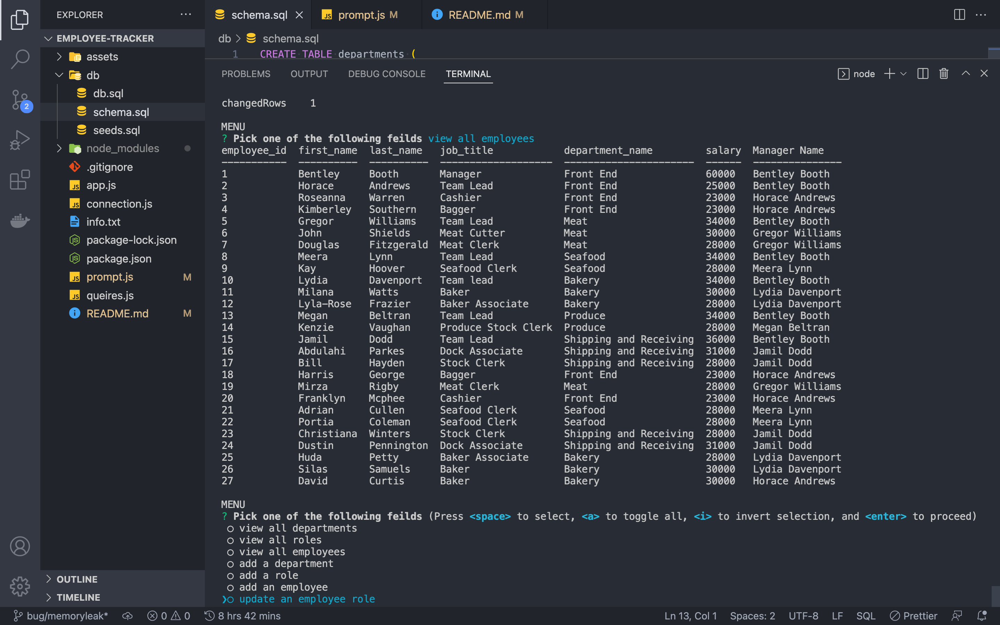

# employee-tracker

## Description

Keep track of all your employees as well as departments and roles. This application does all the work for you so you don't have to write out a exel spreadsheet.

### Check out the Demo here

## Table of Contents

[Installation](#installation)
[Usage](#usage)
[License](#license)
[Contributing](#contributing)
[Tests](#tests)
[Questions](#questions)

## Installation

`npm i`

## Usage

npm i and enjoy :)

## License

This project is licensed under the MIT license

## Contributing

If you want to contribute, you can fork the repo and submit a PR request.

## Tests

No tests to run

## Questions

If you have any questions about the repo, open an issue or contact me directly at [heythereimdavidcurtis@gmail.com](mailto:heythereimdavidcurtis@gmail.com). You can find mor of my work at [DavidebCurtis](https://github.com/DavidebCurtis)
